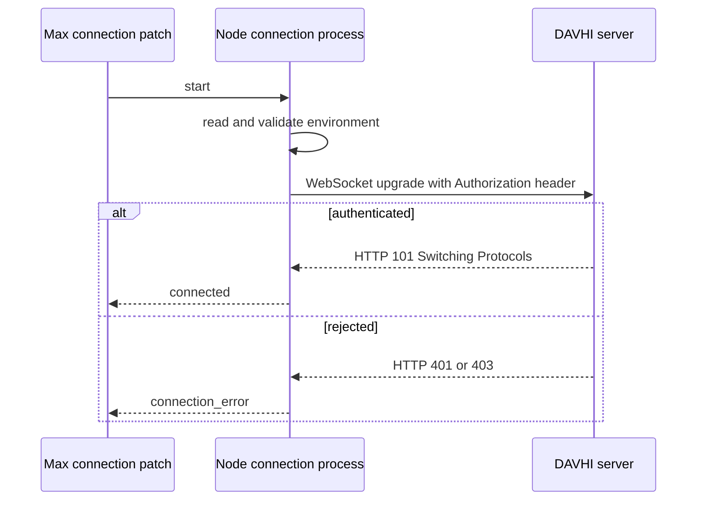

# WebSocket handshake strategy

This document defines the initial connection and acknowledgement strategy between the DAVHI Max connection patch and the server.

## Configuration

The connection reads its WebSocket destination and performance token from the local environment. The WebSocket URL includes the server path required for the connection.

```dotenv
DAVHI_WEBSOCKET_URL=wss://example.org/path
DAVHI_PERFORMANCE_TOKEN=
```

The token is sensitive. A local `.env` file supplies its value and must not be committed. An `.env-template` documents the required variable names without values.

## Connection flow



The client sends the performance token in the WebSocket upgrade request using the standard HTTP authorization header:

```http
Authorization: Bearer <performance-token>
```

> **Note:**
> The http request and upgrade is handled by the ws library

The server uses this token to authenticate the connection and identify its performance session. A successful WebSocket upgrade means the connection is authenticated. A missing, invalid, or unauthorized token must reject the upgrade with HTTP `401` or `403`.

## Acknowledgements

The server sends one acknowledgement for each received event. The `eventId` correlates the acknowledgement with the event that Max submitted.

```json
{
  "type": "ack",
  "eventId": "intro-haptic-001",
  "status": 202
}
```

For a rejected event, the server includes an actionable error message:

```json
{
  "type": "ack",
  "eventId": "intro-haptic-001",
  "status": 422,
  "error": "payload.intensity must be between 0 and 1"
}
```

The initial status meanings are:

- `202`: The server accepted the event for distribution. It does not mean that every device has executed it.
- `400`: The submitted message is malformed.
- `422`: The message is well formed but the event is invalid for the schema or active session.
- `500`: The server could not process the event.

Authentication failures occur during the WebSocket upgrade and use HTTP `401` or `403`, rather than an acknowledgement message.

## Inbound message routing

`type` reserves a stable discriminator for server-originated messages. The initial client recognizes `"ack"`. A future server-to-Max performance event can use a separate type, for example:

```json
{
  "type": "event",
  "event": {
    "schemaVersion": "1.0",
    "eventId": "server-cue-001",
    "sequence": 99,
    "type": "caption",
    "timestamp": null,
    "payload": { "text": "Ready" }
  }
}
```

This extension is not part of the initial connection implementation. The server's metadata-driven schema design and any other future inbound message types remain unspecified.
